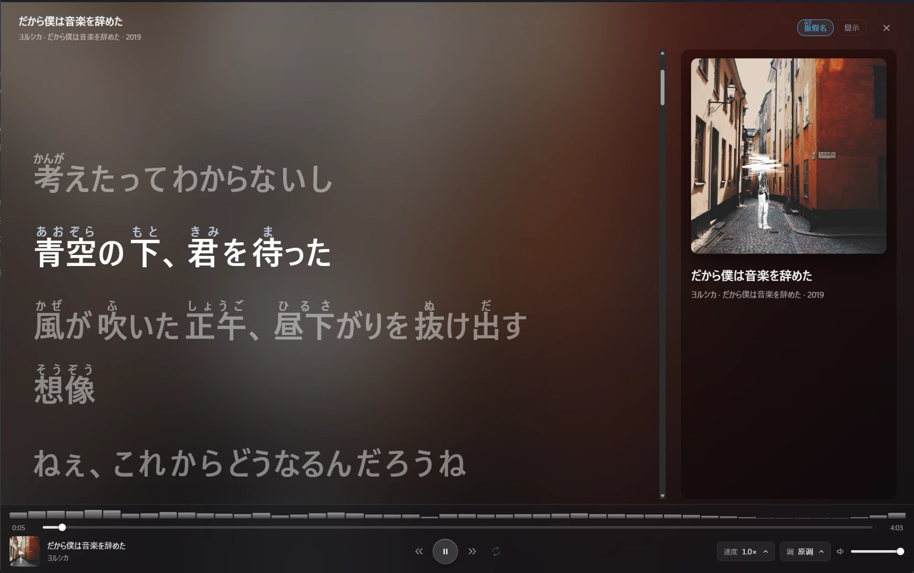
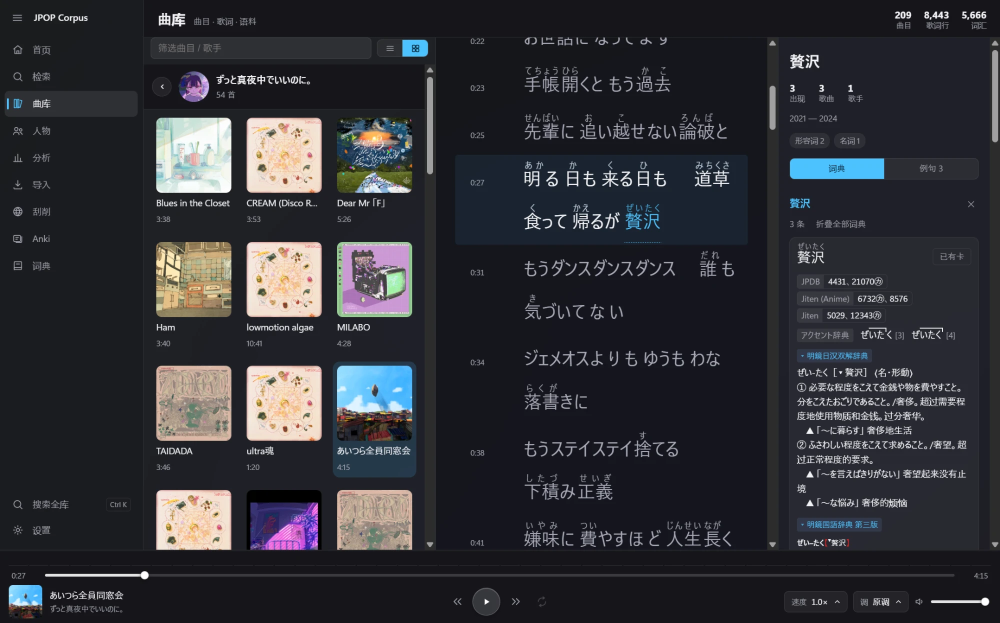
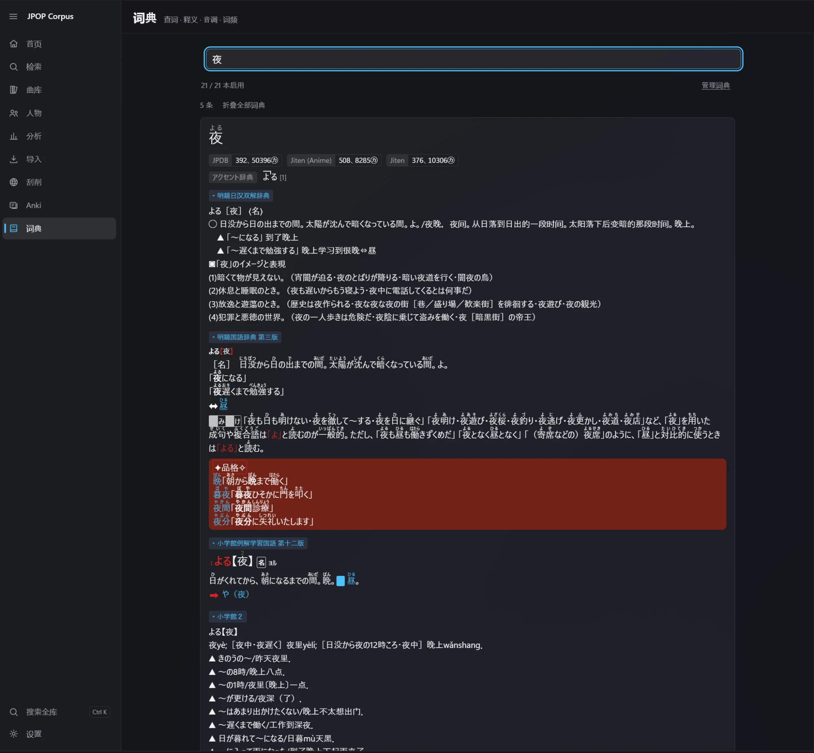
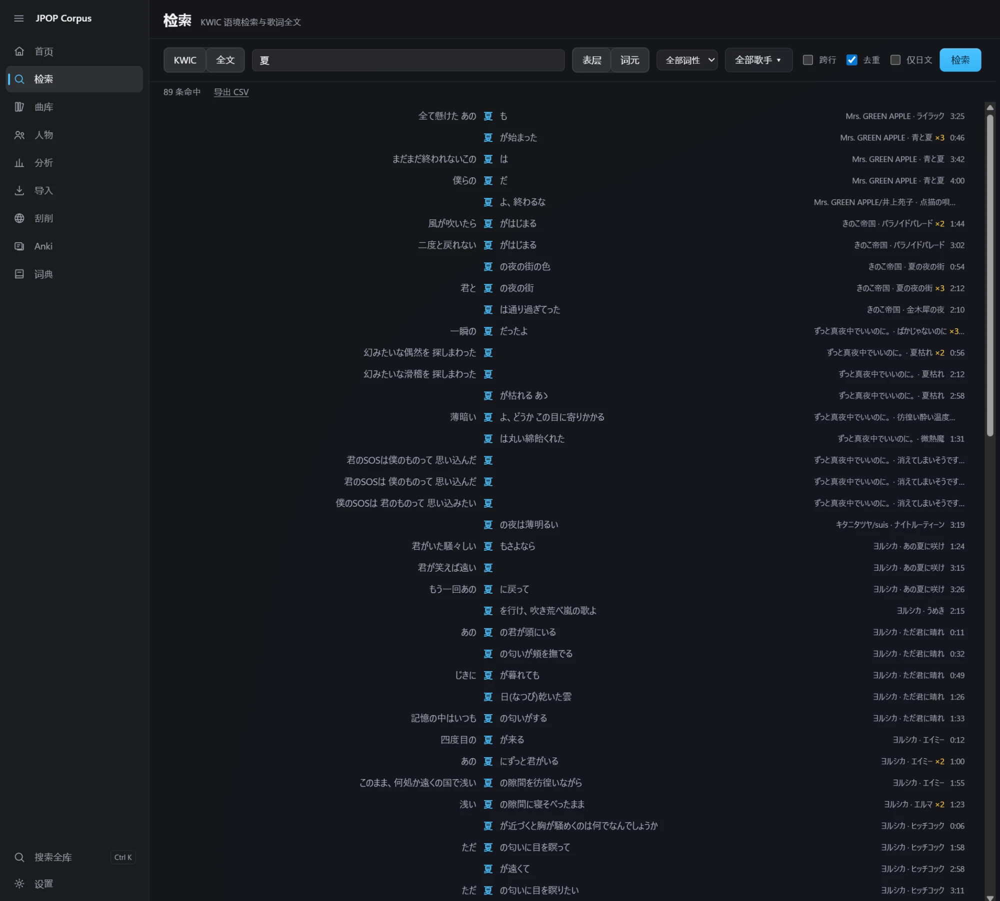
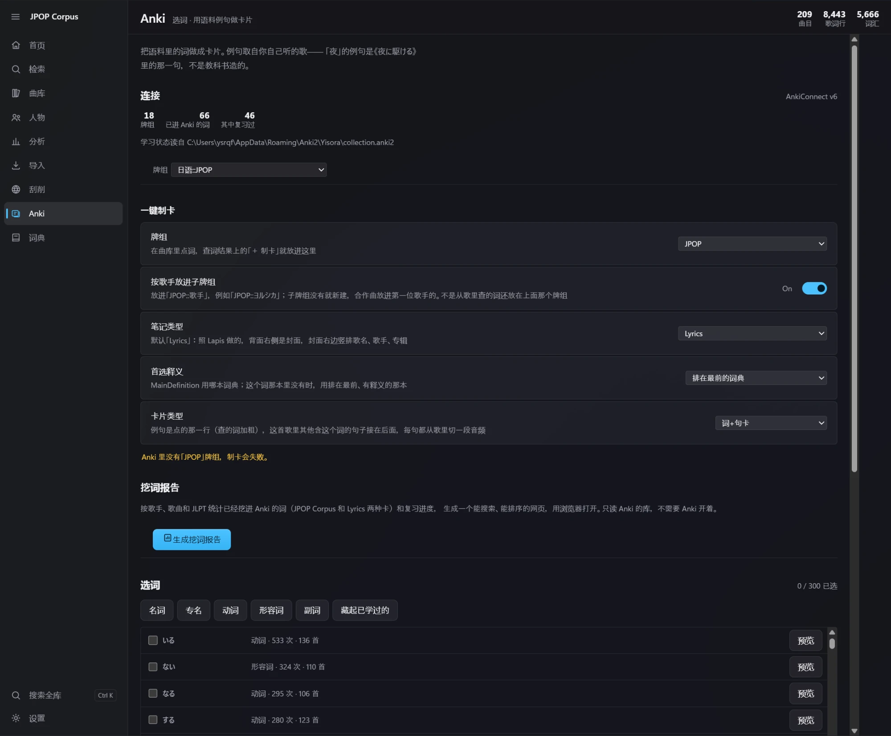
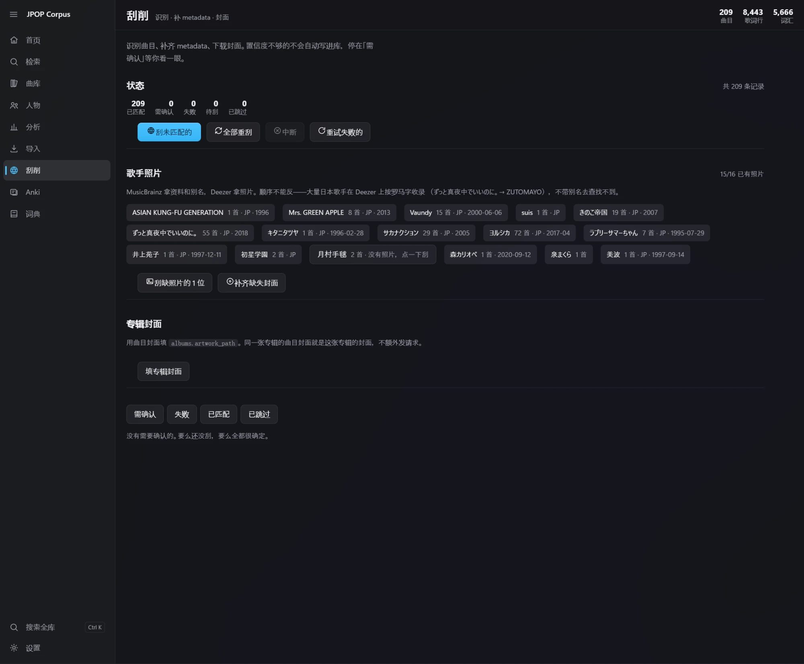
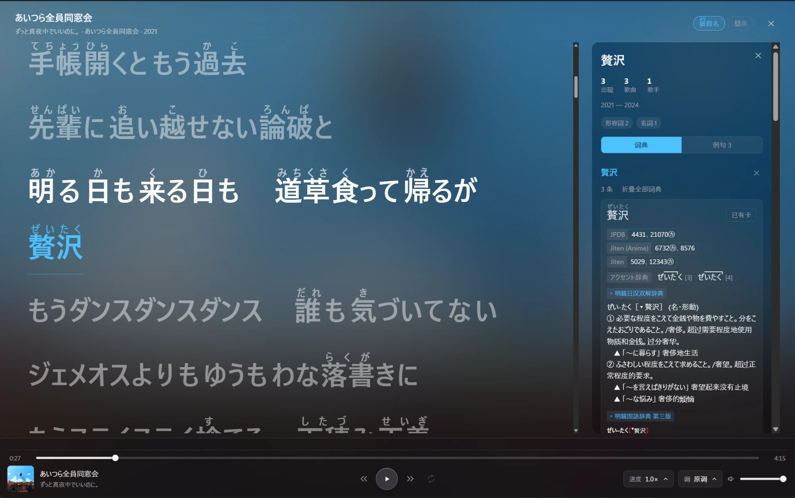
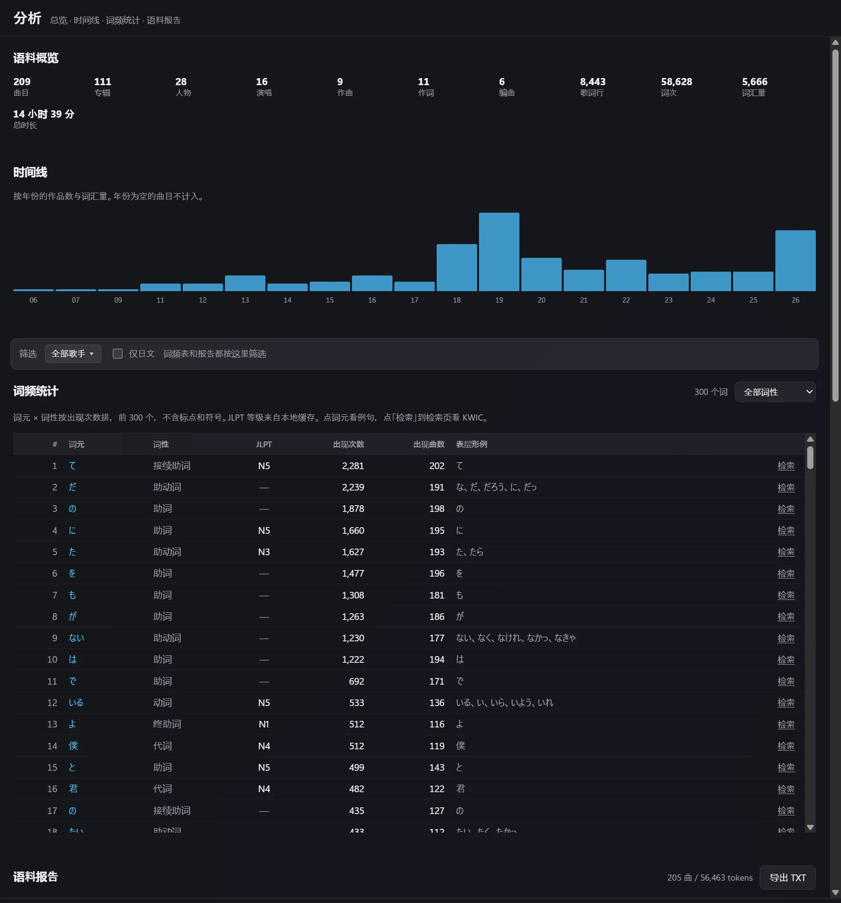
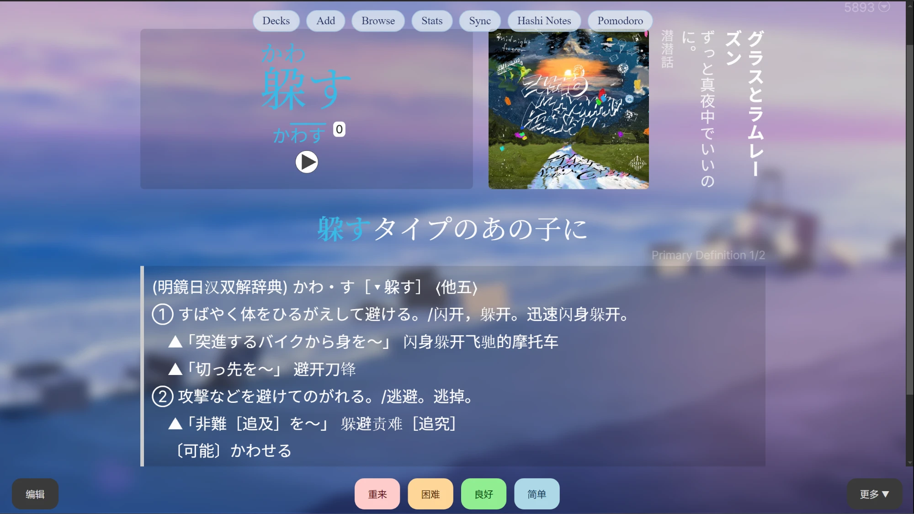

<div align="center">

# JPOP Corpus Tool

[](LICENSE)
[](https://github.com/Yisoragoto/jpop-corpus-tool/releases)
[](#development)

A local J-pop corpus for Japanese learners. Import songs and LRC lyrics you own, read them line by line
along with the audio, look words up Yomitan-style, and turn the lines you just heard into Anki cards.

**English** · [简体中文](README.zh-CN.md)

<table>
<tr>
<td></td>
<td></td>
</tr>
<tr>
<td></td>
<td></td>
</tr>
<tr>
<td></td>
<td></td>
</tr>
</table>

</div>

> This repository ships source code and build tooling only. It contains no commercial songs, lyrics,
> third-party dictionaries, Anki decks or pre-built corpus database.

## Download

Grab the latest `JPOP.Corpus.Tool_x.y.z_x64-setup.exe` (or the `.msi`) from
[Releases](https://github.com/Yisoragoto/jpop-corpus-tool/releases). Windows 10/11 needs the
**WebView2 runtime**, which the system usually already has and the installer offers to add if not.

**Settings → System** checks for new releases, shows the changelog, and can download and install
an update for you — the installer is pulled from this repository's Releases and its SHA-256 is verified
before anything is run. Automatic installing is off by default.

Since 0.2.0 the desktop app is Tauri 2 + React + Rust (0.1.x was PyQt6). The old Python code is still
in the repository for reference, and `corpus.db` works with both.

## Features

### Library and playback

- Library grouped by artist, as a list or a cover grid; the grid starts with an artist wall you can drill into.
- Lyrics follow playback line by line; click a line to jump there, or loop a single line.
- Speed changes go through WSOLA time-stretching (**pitch stays put**); key changes render through FFmpeg and are cached.
- Full-screen lyrics with the cover art blurred to fill the background, and the player floating on top as frosted glass.
- Furigana over kanji only or over whole words; font, size, line height and letter spacing are all adjustable.

### Word lookup (Yomitan dictionaries)

[Yomitan](https://github.com/yomidevs/yomitan) is the browser pop-up dictionary for Japanese (the successor to
Yomichan). It defines a dictionary package format: one zip holding terms, reading-aware frequencies, pitch accent
and structured glossaries. **Lookup here is a port of what Yomitan does, to Rust**, so it eats those dictionaries
directly:

- Import Yomitan zips on the Dictionaries page, as many as you like, and drag them into the order results follow.
- Inflected forms, katakana and romaji all resolve; matching runs from the clicked word to the end of the line,
  so clicking the first word of 打ち込んでいませんでした gets you back to 打ち込む.
- Glossaries keep their original structure (nesting, examples, images); pitch and frequency are shown per reading.
- Clicking a word in the library puts **Dictionary** and **Examples** side by side: the glossary, and every line
  in your own corpus where that word appears.

**Dictionaries are not included.** [MarvNC/yomitan-dictionaries](https://github.com/MarvNC/yomitan-dictionaries)
collects download links for the usual ones (JMdict, 三省堂, 明鏡, JPDB frequency, pitch-accent dictionaries…).
Each dictionary's licence and redistribution terms are its author's; check them yourself.



### Search and analysis

- KWIC concordance with the keyword centred; filter by artist, part of speech, cross-line matches or Japanese-only, export CSV.
- Frequency table (lemma × POS with JLPT level), a timeline by year, and a corpus report as TXT.
- People view: vocals / composer / lyricist / arranger, plus a collaboration graph.



### Anki mining

[Anki](https://apps.ankiweb.net/) is the open-source spaced-repetition app;
[AnkiConnect](https://ankiweb.net/shared/info/2055492159) is the add-on that opens a local port for other programs
to add cards through. That is how cards get made here — **local only, nothing is uploaded**.

- Press **＋ Mine** on a lookup result: word, glossary, frequency, pitch and a real example go into Anki together.
- Ships a **Lyrics** note type adapted from [Lapis](https://github.com/donkuri/lapis): cover art on the right of the
  back side, with title, artist and album set vertically beside it. Created on first use if Anki doesn't have it.
- The example is the line you clicked, followed by the other lines in that song containing the word — **each with its
  own audio clip cut from the song**.
- Optional per-artist subdecks; reads Anki's learning state so words you already know can be left out.
- A mining report (HTML) lists, by JLPT level, the words in your corpus that have no card yet.



### Importing and metadata

- Import a folder **or individual songs**; scanning is read-only, nothing is written until you have reviewed the plan;
  **the original metadata in your files is never overwritten**.
- Lyrics: an `.lrc` sitting next to the audio is picked up on import. When there is none —
  - **Settings → Library maintenance → Fill in missing lyrics** does the whole library: it looks next to the audio
    first, then searches online (NetEase).
  - Per song, the library offers **Fetch online** and **Import a lyrics file…** (`.lrc` / `.txt`; UTF-8, Shift-JIS and GBK are all read).
  - **No guessing**: a candidate is accepted only if title, artist and duration all line up — too many songs share a
    title, and the wrong lyrics are worse than none. Whatever can't be matched is left for you to supply.
  - Fetched lyrics land in `raw/lyrics_lrc/{song_id}.lrc` beside the imported ones, and tokenisation you corrected
    by hand is re-applied by text, so it survives replacing the lyrics.
- Scraping: iTunes → MusicBrainz for tracks, Cover Art Archive for covers, Deezer for artist photos. Anything below
  the confidence threshold stops in a review queue for a human.
- Already have a library somewhere else (a 0.1.x checkout, say)? **Settings → Library maintenance → Migrate from
  another library directory** previews what would move, then **merges** songs, lyrics, tokenisation, credits, play
  history and dictionaries into the current library. Songs you already have are skipped, and audio files are not
  copied — they keep playing from where they are.

## First run

1. Open **Import**, pick a folder of audio you legally own, or choose individual files. An `.lrc` with the same
   name next to the audio is matched automatically.
2. Review the scan plan, then import.
3. If songs came in without lyrics, use **Settings → Library maintenance → Fill in missing lyrics**, or handle a
   single song from the library.
4. For covers and metadata, run the **Scrape** page.
5. For lookup, import Yomitan zips on the **Dictionaries** page (dictionaries registered by 0.1.x can be migrated in one click).
6. For mining, start Anki with AnkiConnect installed (see below).

### Data directory

`corpus.db`, `raw/audio`, `raw/lyrics_lrc`, `raw/covers` and `dictionaries.db` are looked up in this order:

1. the `JPOP_CORPUS_HOME` environment variable;
2. the directory picked in Settings (remembered in `%LOCALAPPDATA%\JPOP Corpus Tool\settings.json`);
3. walking up from the executable, the first database that **has its tables**;
4. the current working directory;
5. otherwise `%LOCALAPPDATA%\JPOP Corpus Tool`, **creating an empty library there**.

So a fresh install opens straight away with an empty library. If you already have one (coming from 0.1.x, say),
point **Settings → About → Library → Change directory…** at it and restart. The data directory lives outside the
install directory, so uninstalling never takes your songs and corpus with it.

> **Live tokenisation needs the Sudachi dictionary.** The tokeniser reads `venv/Lib/site-packages/sudachipy` and
> `sudachidict_core` **inside the library directory** — the same copy 0.1.x uses. Without it, lookup, playback,
> search and mining still work; only furigana and tokenisation on import are unavailable. Create a venv in the
> library directory from `requirements.txt` to get it.

### Anki

1. Install and start [Anki](https://apps.ankiweb.net/).
2. Install [AnkiConnect (add-on code 2055492159)](https://ankiweb.net/shared/info/2055492159).
3. Choose a deck and note type in **Settings → Mining** (the bundled **Lyrics** type is the default and is created on first use).

AnkiConnect listens on `http://127.0.0.1:8765` only, and this tool sends your corpus or Anki data nowhere.
Mining **only appends**: a word you already made a card for is skipped, never overwritten.

### FFmpeg (optional)

The installer does not include FFmpeg. Without it, two things are unavailable: **key changes** (speed changes
don't need it) and **audio clips on Anki cards**. Everything else works.

`ffmpeg.exe` is looked up in this order:

1. every directory on `PATH`;
2. the library directory, i.e. the one holding `corpus.db` (by default `%LOCALAPPDATA%\JPOP Corpus Tool`).

The folder the program is installed in is **not** searched. **Settings → System → FFmpeg** and the diagnostics
report show whether it was found and the exact path to put it at. Restart the app after adding it.
Any recent Windows build from [ffmpeg.org/download](https://ffmpeg.org/download.html) works.

## Development

### Prerequisites

- [Node.js](https://nodejs.org/) 20+
- [Rust](https://rustup.rs/) stable
- Windows 10/11 with the WebView2 runtime

### Run

```powershell
git clone https://github.com/Yisoragoto/jpop-corpus-tool.git
cd jpop-corpus-tool\app
npm install
npm run app:dev
```

### Build

```powershell
npm run app:build    # installers land in rust/target/release/bundle/
```

### Checks

```powershell
cd app
npm run typecheck
npm test
cd ..\rust
cargo test --workspace
cargo clippy --workspace --all-targets
```

The first launch creates an empty library in the data directory. `examples/` shows the data formats without any
copyrighted content.

### Project layout

```text
app/           Frontend (React 19 + TypeScript strict + Vite)
rust/          Rust workspace
  jp-app/        Tauri shell: commands, state, path permissions
  jp-corpus/     Data layer; all SQL lives here
  jp-tokenizer/  Tokenisation and UPOS mapping (Sudachi)
  jp-audio/      Playback: WSOLA stretching, spectrum, single-line loop
  jp-dict/       Yomitan-style lookup and dictionary import
  jp-anki/       Card mining and the mining report
  jp-scraper/    Track identification, covers, artist photos, online lyrics
  jp-import/     Scan, plan, write
  jp-normalize/  Title / artist normalisation
docs/          Design notes and reconciliation records per subsystem
dialogs/       0.1.x PyQt UI modules (kept for reference)
scripts/       0.1.x metadata and database scripts
assets/fonts/  Bundled OFL fonts and their licences
examples/      Data-format samples with no copyrighted content
raw/           Local audio and lyrics; contents are git-ignored
```

`docs/` records how each subsystem works, why it was done that way, and which numbers were reconciled against
the old version during the port.

## Libraries

| Name | Licence |
|---|---|
| [Tauri 2](https://tauri.app/) | Apache-2.0 / MIT |
| [React 19](https://react.dev/) | MIT |
| [rodio](https://github.com/RustAudio/rodio) · [rodio-wsola](https://crates.io/crates/rodio-wsola) | MIT / Apache-2.0 · Apache-2.0 |
| [Symphonia](https://github.com/pdeljanov/Symphonia) (decoding) | MPL-2.0 |
| [sudachi.rs](https://github.com/WorksApplications/sudachi.rs) | Apache-2.0 |
| [rusqlite](https://github.com/rusqlite/rusqlite) · SQLite | MIT · Public Domain |
| [ureq](https://github.com/algesten/ureq) | MIT / Apache-2.0 |
| [serde](https://serde.rs/) | MIT / Apache-2.0 |

## Attribution

| Name | What | Licence |
|---|---|---|
| [Yomitan](https://github.com/yomidevs/yomitan) | Dictionary lookup, deinflection, structured content, pitch display | GPL-3.0-or-later |
| [Lapis](https://github.com/donkuri/lapis) | Basis for the bundled **Lyrics** note type | GPL-3.0 |
| [hoshidicts](https://github.com/Manhhao/hoshidicts) | Dictionary storage design (no code copied) | GPL-3.0-or-later |
| [Klee One](https://fonts.google.com/specimen/Klee+One) · [LXGW WenKai](https://github.com/lxgw/LxgwWenKai) | Bundled fonts | SIL OFL 1.1 |
| [FFmpeg](https://ffmpeg.org/) | Optional, **not bundled**: key changes and Anki audio clips ([where to put it](#ffmpeg-optional)) | LGPL-2.1+ or GPL-2.0+, depending on the build you download |

Per-file provenance is noted in the file headers; the full statement is in
[THIRD_PARTY_NOTICES.md](THIRD_PARTY_NOTICES.md).

## Copyright boundaries

Please do not commit or redistribute:

- commercial song audio, or lyrics and LRC files you have no right to;
- a `corpus.db`, processed corpus or Anki deck containing real lyrics;
- third-party Yomitan dictionaries without redistribution permission;
- local settings, caches, backups and user paths.

This tool processes material you provide and have the right to use. Copyright and fair-use rules differ by
jurisdiction; satisfy yourself about the ones that apply to you.

## License

Source code: [GNU General Public License v3.0 or later](LICENSE) (GPL-3.0-or-later).
Copyright (C) 2026 Yisoragoto and JPOP Corpus contributors.
